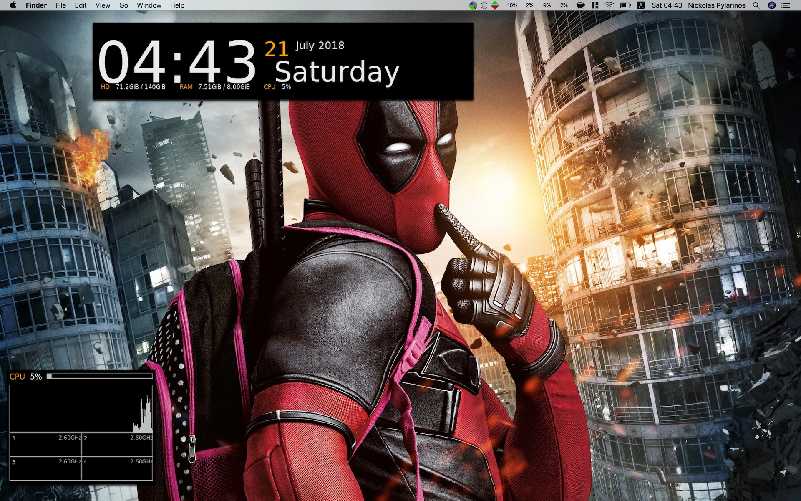

# npyl_theme

A conky theme made by me [(npyl)](https://npyl.github.io/about) using cool conky widgets (Gotham, TeeJee-4-Core)

***(Yes, the wallpaper is included in the theme)***

## PREVIEW



## DONATING 💰

[](https://www.paypal.com/cgi-bin/webscr?cmd=_s-xclick&hosted_button_id=NSV636CUWX754)


```
BTC: 31qFE5JFeReEftU1sjDqigUDmpxYuTdwQm
BCH: qq04pjvvlx406r7pd9dm3ft2smc4qc2njyjccpd6kw
LTC: 3N1EuxbmeXeTFjLEqmHeZfjK7HUig9XzpX
```

***NOTE:*** ManageConky should always have the up-to-date version of the keys; Just go to **About->Press the Bitcoin icon** and you got it. <br>
Thank you. :beers:
